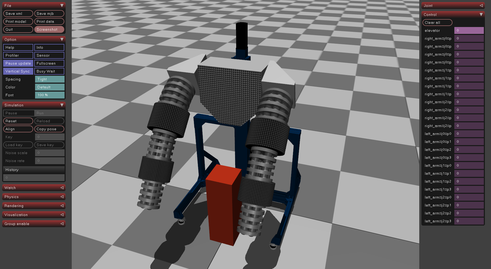

# Baloo Simulation

This repository contains the code for a simulation of a robot named Baloo. 

<!-- add  scresnshot.png-->


## Overview

The main class in the code is `Baloo`, which represents the robot. The `Baloo` class has methods for setting up the simulation, including setting compiler options, visual settings, and contact settings. It also has methods for creating the robot's body parts and actuators.

The robot is composed of a number of disks, which can be specified when creating a `Baloo` instance. The robot also has a number of joints, and the height of these joints can be adjusted.

The simulation includes a world plane and a fixed camera view. There is also a box object in the simulation that the robot can interact with.

## Getting Started

### Python 

There are a few steps to install and set up the simulation:

1. Clone the repository
2. Install dependencies with ```pip install -r requirements.txt```
3. pip install the package. This will automatically build and install the C++ plugins to the pip-installed mujoco location. On my system, this is in the ```plugin``` directory of the mujoco pip installation.
4. Once installed, on the first import of the package, the mujoco model xml files will be generated in the pip-installed mujoco location, and then available for loading in a simulation.
5. You can run a simulation loop with the command line with ```run-baloo-sim```. This command runs [```controllers/baloo_open_loop.py```](./src/baloo_mujoco_sim/controllers/baloo_open_loop.py).


Here's an example of how to do this:

``` bash
git clone <repo-url>
cd baloo_mujoco_sim

# install dependencies, install package, and build plugins
./install.sh

# run simulation (which will import the package and generate the mujoco xml files)
run-baloo-sim
```

### C++
If you have a C++ version of mujoco, you can build the plugins with CMake. The CMakeLists.txt file is in the ```plugin``` directory. You can build the plugins with the following commands:

``` bash
cd plugin
mkdir build
cd build
cmake .. -DMUJOCO_ROOT_DIR=<path-to-mujoco> -DCMAKE_BUILD_TYPE=Release
make install
```

This will build the plugins and install them in the mujoco directory. You can then run the simulation without the python interface. 

## Python Package API

The package exposes a few different things:

1) An ```XML_PATH``` variable that points to the xml files to load a mujoco simulation.
2) A ```baloo_mj_api``` utility module that has a few helper functions for interacting with the mujoco simulation.

Example usage:

``` python
import mujoco
import baloo_mujoco_sim as baloo_mj
from baloo_mujoco_sim.utils.baloo_mj_api import set_joint_pressure_commands

# Load the simulation
 model = mujoco.MjModel.from_xml_path(baloo_mj.XML_PATH)
 data = mujoco.MjData(model)


 # later in simulation loop...
 set_joint_pressure_commands(model, data, 'left', 0, [0,0,0,0])
 ```

See [```utils/baloo_mj_api.py```](./src/baloo_mujoco_sim/utils/baloo_mj_api.py) for more details on the functions that are available. In general, the functions are for setting joint commands, getting joint angles, and getting tactile sensor readings.

## Simulation Assumptions

* The inertia of the links (since this is tough to measure accurately) is assumed to be a [solid cylinder](https://en.wikipedia.org/wiki/List_of_moments_of_inertia#:~:text=%5D-,Solid%20cylinder%20of%20radius%20r%2C%20height%20h%20and%20mass%20m,-%F0%9D%90%BC)
* The mass of the joints is divided evenly (i.e. lumped evenly) between the disks that compose the joint. Each disk is assumed to be a solid cylinder as well. This also assumes that the distribution of mass is roughly uniform along the length of the joint.
* The joint_angle_estimator plugin assumes constant curvature of the joint. This is not true in the real world and is also not assumed in the simulation. The plugin is a simply estimates a constant curvature angle based on the first and last disks of the joint.
* Mostly for RL training, I used custom contact filtering using the contype and conaffinity parameters in Mujoco. The parameters are set so that the only thing that can trigger a tactile sensor response is the manipuland, not the robot itself. This is not realistic, but it is useful for training RL agents to avoid learning to punch itself.


